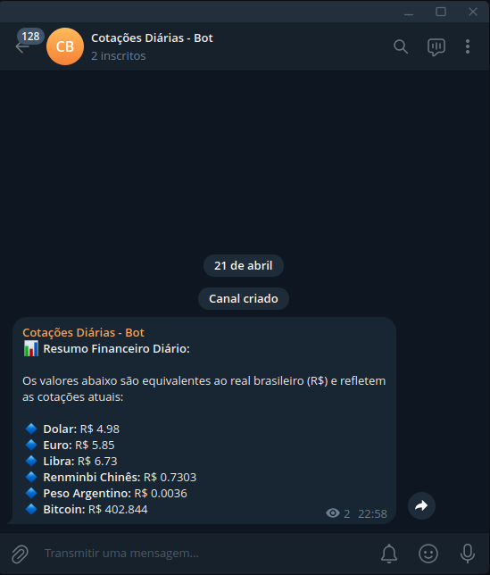

# Daily Currency Bot

Um pipeline ETL (Extract, Transform, Load) leve e automatizado construído em Python. 
O sistema extrai dados financeiros de uma API pública, formata as cotações e notifica o usuário diariamente via Telegram.

Este projeto foi desenvolvido para demonstrar habilidades como o uso de APIs REST, isolamento de credenciais e CI/CD através de automação em nuvem.

## Arquitetura e Fluxo de Dados

O fluxo de execução é direto e modularizado:
1. **Extract:** Consumo da AwesomeAPI para capturar cotações em tempo real (USD, EUR, BTC contra BRL).
2. **Transform:** Limpeza do JSON de retorno e formatação dos valores decimais para a moeda local.
3. **Load / Notify:** Disparo de requisição POST via Telegram Bot API para entregar a informação formatada.
4. **Automation:** Orquestração diária na nuvem utilizando GitHub Actions, sem dependência de máquina local.

## Tecnologias Utilizadas

* **Python 3.13**
* **Requests** (Comunicação HTTP)
* **python-dotenv** (Gerenciamento de variáveis de ambiente)
* **uv** (Gerenciamento rápido de dependências e ambientes virtuais)
* **Telegram Bot API** (Interface de entrega)
* **GitHub Actions** (Automação e agendamento via Cron)

## Prova de Execução

Abaixo está a demonstração do pipeline em funcionamento, entregando o resumo financeiro diário:

